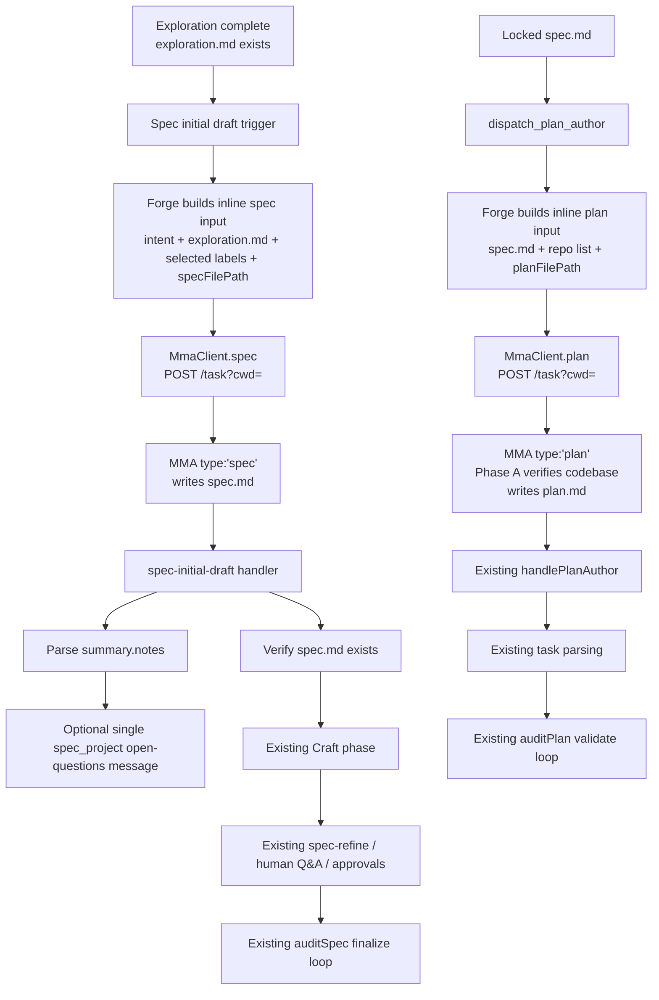

# Forge: Adopt mma-spec and mma-plan for Spec and Plan Authoring

## Context

### Background
Forge (`multi-model-agent-forge`) is a Next.js collaborative SDLC application that drives teams through a gated delivery pipeline: Exploration → Spec → Plan → Execute → Review → Journal. The application delegates long-running reasoning work to the multi-model-agent (MMA) engine over HTTP and stores durable stage artifacts in the owning team workspace at `<teamRoot>/.mma/projects/<projectId>/`.

Two of those artifacts are authoring outputs rather than ephemeral chat state:

- `exploration.md` captures the exploration synthesis and gates the advance into the Spec stage.
- `spec.md` is the durable specification refined collaboratively during the Spec stage.
- `plan.md` is the durable implementation plan parsed into plan tasks during the Plan stage.

At Forge HEAD `1c9862416561ef6bcf49859470a48298ea36ac90`, spec and plan authoring are inconsistent with the rest of the MMA integration. Forge already uses dedicated MMA task types for audits, but the initial spec draft and plan authoring still run through the generic `orchestrate` route with Forge-maintained prompts. The relevant verified Forge-side code is:

- Spec drafting prompt builder: `src/spec/auto-draft.ts`, exported `buildAutoDraftRequest(...)`.
- Spec drafting terminal handler: `src/dispatch/handlers/spec-auto-draft.ts`, registered as `spec-auto-draft`.
- Plan authoring prompt: `src/build/plan-author.ts`, exported `PLAN_AUTHOR_SYSTEM_PROMPT`.
- Plan author action dispatch: `src/automation/details-actions.ts`, `dispatch_plan_author`.
- Plan author terminal handler: `src/dispatch/handlers/plan-author.ts`, registered as `plan-author`.
- Current MMA client surface: `src/mma/client.ts`, which provides typed wrappers for `auditPlan`, `auditSpec`, `auditInline`, `executePlan`, `review`, `journalRecall`, `investigate`, and `research`, plus generic `dispatch(...)`, but no typed `spec(...)` or `plan(...)`.

Forge's specification document structure already aligns with the engine's shared standard. The canonical component kinds in `src/db/enums.ts` are:

```ts
export const COMPONENT_KIND = [
  'context',
  'problem',
  'goals_requirements',
  'alternatives',
  'technical_design',
  'testing_plan',
  'risks',
  'stories_tasks',
] as const;
```

The canonical rendered labels in `src/spec/components.ts` are:

```ts
[
  { kind: 'context', label: 'Context' },
  { kind: 'problem', label: 'Problem' },
  { kind: 'goals_requirements', label: 'Goals & Requirements' },
  { kind: 'alternatives', label: 'Alternatives' },
  { kind: 'technical_design', label: 'Technical Design' },
  { kind: 'testing_plan', label: 'Testing Plan' },
  { kind: 'risks', label: 'Risks & Mitigations' },
  { kind: 'stories_tasks', label: 'User Stories & Tasks' },
]
```

That 1:1 alignment matters because `src/spec/spec-file-ops.ts` already parses `spec.md` by exact `## <component>` and `### <section>` headings, and `src/plan/plan-file-ops.ts` already parses `plan.md` by `## <phase>` and `### <task>` headings. The goal of this feature is therefore not to redesign the pipeline, but to route authoring to the engine's dedicated `mma-spec` and `mma-plan` task types while preserving Forge's existing collaborative and audit stages.

## Problem

### Problem
Forge currently authors both `spec.md` and `plan.md` through the generic `orchestrate` route, which makes authoring behavior depend on Forge-owned prompts instead of the MMA engine's dedicated spec and plan pipelines.

This creates three concrete failures:

1. Spec authoring is a single main-tier pass with no dedicated cross-model refiner gate, so the first durable draft is lower quality than the engine's packaged `mma-spec` flow.
2. Plan authoring does not perform Phase-A repository verification before writing `plan.md`, so the author can guess file paths, symbols, and test commands instead of grounding them in the codebase.
3. Forge must maintain frozen authoring prompts (`buildAutoDraftRequest` and `PLAN_AUTHOR_SYSTEM_PROMPT`) that drift away from the engine's evolving standard, which increases maintenance cost and weakens consistency across MMA consumers.

The business impact is direct:

- Higher token cost, because authoring runs on the main-tier orchestrate path instead of the cheaper `complex` worker tier used by the dedicated task types.
- Lower artifact quality, because there is no spec refiner gate at initial draft time and no plan-time verification pass.
- More product drift, because the shared engine standard improves in one place while Forge continues shipping older prompt copies.

The problem is not downstream incompatibility. Forge's downstream stages already operate on files and parsers that match the engine's heading structure. The problem is that the initial authoring seam is routed through the wrong MMA interface.

## Goals & Requirements

### Goals
1. Route the initial whole-document spec draft at the Exploration → Spec seam through `mma-spec`.
2. Route locked-spec plan authoring through `mma-plan` so plan generation performs real codebase verification before writing `plan.md`.
3. Preserve Forge's collaborative Craft stage, human Q&A, approval flow, audit loops, and task parsing behavior after the route swap.
4. Eliminate Forge-owned spec and plan authoring prompts so the MMA engine becomes the single source of truth for those authoring standards.

### Functional requirements
FR-1. The system must add typed `spec()` and `plan()` methods to `src/mma/client.ts` so Forge can dispatch `type:'spec'` and `type:'plan'` tasks without going through the generic `dispatch('orchestrate', ...)` helper. Rationale: the dedicated task types are the contract this feature is adopting, and typed methods keep the client surface consistent with existing typed routes.

FR-2. `MmaClient.spec(...)` must POST a task body with `type: 'spec'` and must rely on the engine's dedicated `spec` task type. Note: worker-tier selection (dispatch to the `complex` tier) is an external MMA orchestration concern, not a Forge-testable assertion. Forge tests verify that `type:'spec'` dispatch is made with the correct body shape; worker-tier selection is verified by MMA daemon compatibility checks before rollout. The Forge request body must accept one target input in the same union shape used elsewhere by MMA authoring tasks: `target: { inline: string }` or `target: { paths: string[] }`, but not both. For this Forge feature, the caller must use the `inline` form. Rationale: the engine contract supports inline or path-backed input, but the initial draft handoff is text assembled by Forge.

FR-3. `MmaClient.plan(...)` must POST a task body with `type: 'plan'` and must rely on the engine's dedicated `plan` task type. Like FR-2, worker-tier selection is an external orchestration concern verified before rollout; Forge tests verify correct `type:'plan'` dispatch. The Forge request body must accept the same `target` union contract as `spec()`. For this Forge feature, the caller must use the `inline` form. Rationale: plan authoring must use the dedicated plan task while keeping the client API symmetric with `spec()`.

FR-4. When the project enters the Spec stage initial-draft step after Outline selection, Forge must dispatch exactly one `mma-spec` task using `cwd = resolveProjectWorkspaceRoot(projectId)` and an output path inside that workspace at the resolved `specFilePath`. The inline input must contain:

- The captured project intent.
- The contents of `exploration.md`.
- The selected Forge component labels in document order.
- The absolute output path where the worker must write `spec.md`.

Rationale: the dedicated spec author should write the first whole document once, grounded in the exploration artifact and the project intent already collected by Forge.

FR-5. The `mma-spec` flow must write the whole initial `spec.md` file with `##` component headings and `###` section headings that remain parseable by the existing `parseSpecSections(...)` implementation in `src/spec/spec-file-ops.ts` with no parser changes. Rationale: downstream Forge stages already operate on the file, so compatibility is a hard contract.

FR-6. After the initial `mma-spec` draft completes, Forge must surface the refiner `notes` as exactly one spec-stage project-level Forge-authored open-questions message. The v1 storage and UI contract is:

- The message is stored in `project_qa_message`.
- `targetId` is the project UUID.
- `targetKind` is the literal string `'spec_project'`.
- `seq` is ordered within that `targetId`.
- `bodyMd` contains the formatted open-questions message derived from the returned `notes`.
- If `notes` is empty, null, or whitespace-only, Forge must not create a message.

Rationale: v1 needs a single durable place to show document-level assumptions without rebuilding the component-level question system or changing the engine's subset-refactor timeline.

FR-7. The existing per-component Q&A seeding behavior in `src/dispatch/handlers/spec-auto-draft.ts` must be preserved in source but made dormant; the markdown assembly and file-writing half of that handler must be removed from the active path. Rationale: the future path back to per-component AI questions should remain a wiring change, not a reconstruction project.

FR-8. Forge's existing Spec Craft phase, human Q&A interactions, human approvals, and `auditSpec` finalize loop must continue to operate on the `mma-spec`-authored `spec.md` without semantic change to their downstream contracts. Explicitly, the stage-status updates, completion events, and `auditSpec` input/output contracts shall remain unchanged. An acceptance test shall exercise the Craft phase, Q&A flow, approvals, and finalize loop as a single flow against an `mma-spec`-authored `spec.md` and verify identical stage-status transitions and completion events. Rationale: Forge's differentiator is the collaborative refinement gate after the initial draft, and this feature must not replace it.

FR-9. The `dispatch_plan_author` action in `src/automation/details-actions.ts` must dispatch `mma-plan` instead of `orchestrate`, using `cwd = resolveProjectWorkspaceRoot(projectId)` and an output path inside that workspace at the resolved `planFilePath`. The inline input must contain:

- The locked `spec.md` body.
- The linked repository list, including each repo name and `pathOnDisk`.
- The absolute output path where the worker must write `plan.md`.

Forge currently loads the linked repository list from `details.linkedRepositories` in the project details object; `dispatch_plan_author` must read this list and transform it to the inline format `- <name> (<pathOnDisk>)`. Before dispatch, `dispatch_plan_author` shall verify that every linked repository entry has a non-empty `pathOnDisk`; if any entry fails validation, the action shall fail with an explicit error and shall not dispatch the task. Rationale: the plan author needs the locked spec plus the actual repository inventory so Phase A can verify paths, symbols, and test commands before the file is written.

FR-10. The `mma-plan` flow must write `plan.md` in a format that remains parseable by the existing `parsePlanSections(...)` implementation in `src/plan/plan-file-ops.ts`, and `src/dispatch/handlers/plan-author.ts` must continue reading and parsing the authored plan without semantic change. Explicitly, `handlePlanAuthor` shall populate `details.stages.plan.phases.refine.tasks` with the same field structure, emit the same completion event, and perform the same downstream task enrollment as before the route swap. Rationale: the downstream Plan stage consumes `###` task sections already, so the route swap must not force a plan parser rewrite.

FR-11. The system must delete the Forge-owned authoring prompt modules and assembly logic that become obsolete after the route swap:

- `buildAutoDraftRequest` in `src/spec/auto-draft.ts`
- The markdown assembly and `writeSpec(...)` path in `src/dispatch/handlers/spec-auto-draft.ts`
- `PLAN_AUTHOR_SYSTEM_PROMPT` in `src/build/plan-author.ts`

Rationale: leaving dead prompt copies behind would preserve the drift problem this feature is intended to remove.

FR-12. All new and changed tests must use mocked provider patterns and mocked persistence utilities only; no test may issue a real LLM call or depend on a live database. Rationale: the feature changes dispatch contracts and parsing behavior, which are deterministic and testable locally.

### Scope
This feature is a single buildable runtime workstream inside Forge. It has no separate release-governance gate and no prerequisite spike deliverable in this repo.

#### Delivery order
1. **EXEC — workstream 1:** adopt dedicated `mma-spec` and `mma-plan` routing in Forge, surface spec refiner notes once at the document level, remove obsolete authoring prompts, and keep downstream refinement and audit flows unchanged.

Executors must plan and implement this workstream as one feature slice. There are no separate prerequisite or release-time workstreams in Forge for this feature.

#### In scope
- Adding typed `spec()` and `plan()` methods to `src/mma/client.ts`.
- Swapping the Spec initial-draft seam from orchestrate auto-draft to `mma-spec`.
- Swapping the Plan authoring seam from orchestrate prompt authoring to `mma-plan`.
- Building the `mma-spec` inline input from captured intent, `exploration.md`, selected component labels, and the resolved output path.
- Building the `mma-plan` inline input from locked `spec.md`, linked repo list, and the resolved output path.
- Surfacing the `mma-spec` refiner `notes` as one project-level open-questions message in the Spec stage.
- Updating the Spec-stage message loader and real-time subscriber UI to emit and consume `scope` and `targetId` in the widened `chat.message` event contract, shipped atomically with the server-side contract change.
- Preserving the dormant per-component Q&A seeding code path in source while removing it from the active initial-draft flow.
- Keeping `parseSpecSections(...)`, `parsePlanSections(...)`, `handlePlanAuthor(...)`, `auditSpec`, and `auditPlan` behavior unchanged.
- Deleting `buildAutoDraftRequest`, the active markdown assembly branch of `handleSpecAutoDraft`, and `PLAN_AUTHOR_SYSTEM_PROMPT`.
- Adding or updating tests that prove route selection, parser compatibility, notes handling, and unchanged downstream parsing.

#### Out of scope
- Designing how the MMA engine chooses a subset of the 8 spec components. Forge will pass selected component labels; engine-side subset behavior is owned by MMA.
- Re-introducing per-component AI clarifying questions as part of v1. The preserved dormant plumbing exists only to reduce future wiring cost.
- Changing the Spec Craft refine flow, human Q&A flow, human approval flow, or the `auditSpec` finalize loop.
- Changing the Plan task validation flow, `plan-refine`, task approvals, or the `auditPlan` finalize loop.
- Changing `parseSpecSections(...)` or `parsePlanSections(...)` to accommodate a new document format.
- Changing non-authoring MMA task routes such as `review`, `journal_record`, `journal_recall`, `execute_plan`, `spec-refine`, `plan-refine`, `spec-audit-apply`, or `plan-audit-apply`.
- Adding backward-compatibility shims for the removed orchestrate authoring code paths.
- Changing the project artifact directory contract `<teamRoot>/.mma/projects/<projectId>/`.
- Any change to the external MMA engine skill packages themselves.

### Constraints
The implementation must satisfy all of the following constraints:

- Compatibility: there is no backward-compatibility requirement for the removed authoring paths. This is a greenfield project path, so obsolete prompt and assembly code may be deleted directly rather than hidden behind shims.
- Module format: all touched runtime code must remain ESM-only and must keep `.js` import specifiers where applicable, following existing repo conventions.
- Testing framework: all tests must run under Vitest and must use mock provider and mock persistence patterns already used in the repo.
- Provider isolation: no test may call a real LLM endpoint, a real MMA daemon, or a real database.
- Artifact writes: both `spec.md` and `plan.md` must still be written inside the project artifact workspace rooted at `resolveProjectWorkspaceRoot(projectId)`.
- MMA sandbox assumption: the dedicated `spec` and `plan` task types use the MMA `cwd-only` write posture, which confines writes to `cwd` while allowing unrestricted read, glob, and grep access. This feature relies on that behavior so a worker rooted at the artifact workspace can still read linked repositories during verification.
- Blocking external prerequisite: the running MMA daemon version must continue to support `type:'spec'` and `type:'plan'` task dispatches, including terminal summaries where the spec route returns `notes`. Artifact: external MMA engine task API contract, not stored in this repo. Unblocking condition: the daemon available to Forge accepts those task types in `/task?cwd=...` and returns the documented summary payload. Worker-tier orchestration (routing `type:'spec'` to the `complex` tier and `type:'plan'` to the `complex` tier) is an external MMA responsibility, verified by daemon compatibility testing before Forge rollout; Forge's test coverage confirms only that the dispatch bodies carry the correct type discriminator.

### Success metrics
| Metric | Target | How measured |
|---|---:|---|
| Initial `spec.md` authored by `mma-spec` | 100% of new project initial spec drafts | Automated tests and runtime dispatch body assert `type: 'spec'` |
| `plan.md` authored by `mma-plan` | 100% of new plan authoring runs | Automated tests and runtime dispatch body assert `type: 'plan'` |
| Parser compatibility preserved | `parseSpecSections(...)` and `parsePlanSections(...)` require zero logic changes | Round-trip fixture tests pass against mma-formatted documents with fixture spec.md and plan.md files in `tests/fixtures/` |
| Forge-owned authoring prompts removed | 0 remaining active prompt definitions for spec/plan authoring | Static code search finds no `buildAutoDraftRequest` or `PLAN_AUTHOR_SYSTEM_PROMPT` references |
| Spec notes surfaced exactly once | 100% of spec drafts with non-empty notes create one document-level message; 0 drafts with empty notes create a message | Handler unit tests for notes-present and notes-empty branches |

## Alternatives

### Driving factors
1. Preserve Forge's collaborative per-component review and approval gate. This is the product differentiator, so any option that replaces Craft or moves refinement entirely into the engine is unacceptable.
2. Minimize downstream churn. Existing parsers, handlers, and audit loops already operate on durable files, so the preferred option changes the authoring seam without forcing format rewrites elsewhere.
3. Improve artifact quality. The chosen approach must add the engine's dedicated refiner gate for specs and codebase verification for plans.
4. Avoid Forge-specific coupling to a moving engine standard. The more Forge duplicates prompt logic locally, the more it drifts during engine refactors.
5. Reduce operating cost where possible. Lower worker-tier cost is valuable, but only after the first four must-have criteria are satisfied.

### Options
#### Option set 1: Role of `mma-spec`

**Option A — `mma-spec` as the initial whole-document drafter at the Exploration → Spec seam. CHOSEN.**

- Pros:
  - Preserves Forge's Craft phase as the collaborative gate.
  - Improves the very first durable draft using the engine's dedicated spec pipeline.
  - Requires no change to `parseSpecSections(...)` or post-draft refine flows.
- Cons:
  - Requires a new notes handoff because the existing auto-draft handler seeded per-component questions.

**Option B — `mma-spec` only as a finalizer after Craft.**

- Pros:
  - Leaves the current first-draft behavior unchanged.
  - Defers integration effort to later in the stage.
- Cons:
  - Misses the main quality gain, because the initial durable artifact still comes from the weaker orchestrate flow.
  - Duplicates authoring effort across Forge prompts and engine prompts.

**Option C — keep orchestrate for spec authoring.**

- Pros:
  - No implementation work.
- Cons:
  - Fails every must-have factor except short-term churn avoidance.

Rationale for the decision: the feature request explicitly asks for `mma-spec` to produce the initial whole `spec.md` and then hand off to Forge's existing collaborative Craft phase. Option A is the only choice aligned with that directive.

#### Option set 2: How to surface clarifying gaps from `mma-spec`

**Option A — surface refiner `notes` as one project-level open-questions message. CHOSEN.**

- Pros:
  - Minimal integration surface.
  - Keeps the engine standard untouched during its subset-driving refactor.
  - Leaves future per-component question support as a wiring change.
- Cons:
  - Less granular than eight separate component prompts.

**Option B — add a new cheap Forge-owned gap-finder pass after `mma-spec`.**

- Pros:
  - Could restore more tailored prompts.
- Cons:
  - Reintroduces Forge-owned prompt maintenance immediately.
  - Adds latency and cost without changing the durable spec authoring source.

**Option C — require the engine to emit per-component questions now.**

- Pros:
  - Best parity with the old UI behavior.
- Cons:
  - Couples this Forge feature to an engine-side refactor outside this repo.
  - Blocks delivery on external work.

Rationale for the decision: human Craft Q&A and the existing `auditSpec` loop are already the real gap-closing mechanisms. A single document-level notes message is sufficient for v1 and avoids pushing new requirements into the shared engine standard.

#### Option set 3: Plan authoring route

**Option A — full swap from orchestrate to `mma-plan`. CHOSEN.**

- Pros:
  - Gains repository verification in Phase A.
  - Keeps `handlePlanAuthor(...)` and `parsePlanSections(...)` unchanged.
  - Removes the Forge-owned plan author prompt.
- Cons:
  - Slightly higher end-to-end latency per run because the engine performs two phases.

**Option B — keep orchestrate for plan authoring.**

- Pros:
  - No routing change.
- Cons:
  - Retains guessed file paths and prompt drift.

Rationale for the decision: the route swap is near drop-in in Forge because the workspace root and plan parser stay the same, while the quality gain is material.

#### Option set 4: Worker `cwd` and output-path control

**Option A — set `cwd` to the project artifact workspace root and direct the worker to write the artifact path inside that root. CHOSEN.**

- Pros:
  - Matches current Forge artifact layout.
  - Satisfies the `cwd-only` write constraint.
  - Still permits repository reads for verification.
- Cons:
  - Requires the prompt/input contract to carry the output path explicitly.

**Option B — set `cwd` to one repo root and write artifacts elsewhere.**

- Pros:
  - Slightly more intuitive for code reads in one repo.
- Cons:
  - Breaks the artifact write confinement rule when the output file is outside that repo root.
  - Becomes ambiguous for multi-repo projects.

Rationale for the decision: artifact writes are the hard constraint, and repository reads remain available under the MMA sandbox posture, so the artifact workspace root is the correct dispatch root.

### Comparison
| Decision area | Option | Preserve Craft gate | Minimize downstream churn | Improve quality | Avoid drift/coupling | Reduce cost | Verdict |
|---|---|---|---|---|---|---|---|
| Spec role | A. Initial `mma-spec` drafter | ✅ | ✅ | ✅ | ✅ | ✅ | **Chosen** because it upgrades the first durable draft without changing downstream Spec-stage collaboration. |
| Spec role | B. Finalizer after Craft | ⚠️ | ⚠️ | ❌ | ⚠️ | ⚠️ | Rejected because the weak initial draft path would remain in place. |
| Spec role | C. Keep orchestrate | ✅ | ✅ | ❌ | ❌ | ❌ | Rejected because it does not solve the problem. |
| Gap surfacing | A. One project-level notes message | ✅ | ✅ | ⚠️ | ✅ | ✅ | **Chosen** because it captures document-level assumptions with minimal integration and no engine refactor dependency. |
| Gap surfacing | B. Extra Forge gap-finder pass | ✅ | ❌ | ⚠️ | ❌ | ❌ | Rejected because it recreates local prompt ownership. |
| Gap surfacing | C. Engine per-component questions now | ✅ | ⚠️ | ✅ | ❌ | ⚠️ | Rejected because it blocks Forge on external engine work. |
| Plan authoring | A. Full `mma-plan` swap | ✅ | ✅ | ✅ | ✅ | ✅ | **Chosen** because it adds path verification and removes prompt drift with near-zero parser churn. |
| Plan authoring | B. Keep orchestrate | ✅ | ✅ | ❌ | ❌ | ❌ | Rejected because it preserves guessed plans. |
| `cwd` control | A. Artifact workspace root | ✅ | ✅ | ✅ | ✅ | ✅ | **Chosen** because it satisfies write confinement while still allowing repository reads. |
| `cwd` control | B. Repo root | ⚠️ | ❌ | ⚠️ | ⚠️ | ⚠️ | Rejected because artifact writes would escape `cwd` for many projects. |

Decision record summary:

- DR-1. Forge will use `mma-spec` only for the initial durable spec draft, not as a finalizer. Rationale: that is where the quality gain has the most leverage and where the user explicitly requested adoption.
- DR-2. Forge will surface `mma-spec` refiner `notes` as one document-level message in v1. Rationale: it is enough to expose assumptions without making Forge or the engine own a new question granularity contract today.
- DR-3. Forge will fully replace orchestrate plan authoring with `mma-plan`. Rationale: the improvement is material and the compatibility cost is low because downstream plan parsing already matches the file format contract.
- DR-4. Both dedicated task types will dispatch with `cwd` set to the project artifact workspace root. Rationale: write confinement is the hard boundary, while repo reads remain available under the sandbox posture.

## Technical Design

### Current state
The following current-state details were verified against Forge HEAD `1c9862416561ef6bcf49859470a48298ea36ac90`.

Artifact and workspace contracts:

- `src/projects/project-workspace.ts`
  - `resolveProjectWorkspaceRoot(projectId, db?)` resolves the owning team workspace root and is the current `cwd` source for project-scoped MMA work.
  - `resolveProjectArtifactDir(projectId, db?)` resolves the artifact directory to `<teamRoot>/.mma/projects/<projectId>`.
- `src/projects/project-files.ts`
  - `specFilePath(projectId, db?)` resolves the `spec.md` path under the artifact directory.
  - `planFilePath(projectId, db?)` resolves the `plan.md` path under the artifact directory.
  - `readSpecFile(...)`, `writeSpec(...)`, `readPlanFile(...)`, and `writePlan(...)` are the file source-of-truth helpers.

Current spec initial-draft flow:

- `src/spec/auto-draft.ts`
  - `buildAutoDraftRequest(...)` reads project intent and exploration content, expands the selected spec outline from DB templates, and returns `{ system, user, outline }`.
  - The prompt is Forge-owned and instructs one main-agent call to draft every section plus attached questions.
- `src/dispatch/handlers/spec-auto-draft.ts`
  - `handleSpecAutoDraft(...)` parses the orchestrate JSON response with `FullSpecDraftSchema`.
  - It assembles the full markdown document by iterating component order and section order, emitting `## <component label>` and `### <draft heading>` blocks.
  - It backs up and writes `spec.md`.
  - It also deletes and recreates component-level `qaMessage` rows keyed by each component UUID and emits `chat.message` SSE events with `componentId`.

Current plan authoring flow:

- `src/automation/details-actions.ts`
  - Action `dispatch_plan_author` resolves `cwd = resolveProjectWorkspaceRoot(projectId, db)`.
  - It reads the locked spec file and repo list from details.
  - It imports `PLAN_AUTHOR_SYSTEM_PROMPT` from `src/build/plan-author.ts`.
  - It interpolates the output path and appends repo list plus locked specification text to one large prompt.
  - It dispatches `dispatchMma({ route: 'orchestrate', handler: 'plan-author', cwd, body: { prompt, reviewPolicy: 'none' } })`.
- `src/build/plan-author.ts`
  - Exports the full Forge-owned authoring prompt with the placeholder `PLAN_FILE_PATH`.
- `src/dispatch/handlers/plan-author.ts`
  - Reads `plan.md` after task completion.
  - Parses sections with `parsePlanSections(...)`.
  - Converts each `###` task heading into `details.stages.plan.phases.refine.tasks`.
  - Marks `d.stages.plan.phases.refine.file = 'plan.md'`.

Current parser contracts:

- `src/spec/spec-file-ops.ts`

```ts
const COMPONENT_HEADING_RE = /^## .+/;
const SECTION_HEADING_RE = /^### .+/;
```

`parseSpecSections(specMd)` splits on `##` component headings and `###` section headings, preserving code fences and returning:

```ts
export interface SpecSection {
  component: string;
  heading: string;
  body: string;
  startLine: number;
  endLine: number;
}
```

- `src/plan/plan-file-ops.ts`

```ts
const TASK_HEADING_RE = /^### (?:Task |[A-Z0-9]+[\s\.\:\—\-]).+/;
const PHASE_HEADING_RE = /^## .+/;
```

`parsePlanSections(planMd)` splits on `##` phase headings and `###` task headings and returns:

```ts
export interface PlanTaskSection {
  heading: string;
  body: string;
  phase?: string;
  startLine: number;
  endLine: number;
}
```

Current MMA client surface:

- `src/mma/client.ts`
  - Exposes generic `dispatch(route, { cwd, body })`.
  - Exposes typed methods for `auditPlan`, `auditSpec`, `auditInline`, `executePlan`, `review`, `journalRecall`, `investigate`, and `research`.
  - Does not expose typed `spec(...)` or `plan(...)`.

Current message and SSE contracts relevant to spec notes:

- `src/db/schema/spec.ts`
  - `project_qa_message` currently stores `targetId`, `projectId`, `targetKind`, `seq`, `bodyMd`, `meta`, `authorId`, and `createdAt`.
  - Existing usage comments state `targetKind` disambiguates `'spec_component'` and `'plan_task'`.
- `src/sse/event-bus.ts`
  - `chat.message` currently emits `{ type: 'chat.message', componentId: string, message: ... }`.

Exploration handoff:

- `src/dispatch/handlers/explore-synthesize.ts`
  - Writes `exploration.md`.
  - Sets `d.stages.exploration.phases.synthesize.file = filePath`, which is the gate allowing the user to continue into Spec.

The net result is that Forge already has compatible file layouts and parsers, but both authoring seams are still powered by local prompts and generic orchestrate dispatches.

### Proposed design
Forge will adopt the dedicated MMA spec and plan task types at the two authoring seams and will keep every downstream file consumer intact. The design intentionally limits change to dispatch construction, one spec-terminal handler, one plan dispatch site, one new document-level message contract, and prompt deletions.

#### Architecture
The feature introduces the following runtime flow:



Architecture decisions:

- The artifact workspace root remains the dispatch `cwd` for both task types. Rationale: this preserves the current artifact write contract and remains compatible with the MMA write sandbox.
- Forge remains responsible for assembling the inline input text and for handling the terminal side effects in its own DB and SSE layers. Rationale: that is the stable boundary between Forge workflow state and MMA task execution.
- The dedicated MMA tasks become responsible for authoring the durable markdown documents themselves. Rationale: that removes local prompt ownership and aligns Forge with the shared engine standard.

#### Interfaces / APIs
The Forge-side typed client additions are:

```ts
export type MmaAuthorTarget =
  | { inline: string }
  | { paths: string[] };

export interface MmaSpecArgs {
  cwd: string;
  target: MmaAuthorTarget;
}

export interface MmaPlanArgs {
  cwd: string;
  target: MmaAuthorTarget;
}

export interface MmaDispatchAccepted {
  batchId: string;
}
```

```ts
class MmaClient {
  async spec(args: MmaSpecArgs): Promise<MmaDispatchAccepted>;
  async plan(args: MmaPlanArgs): Promise<MmaDispatchAccepted>;
}
```

The HTTP body contract for the typed methods is:

```json
{
  "type": "spec",
  "target": {
    "inline": "<assembled input>"
  }
}
```

```json
{
  "type": "plan",
  "target": {
    "inline": "<assembled input>"
  }
}
```

Both methods must preserve the same transport semantics as existing typed methods:

- `POST /task?cwd=<encoded cwd>`
- `Authorization: Bearer <token>`
- `X-MMA-Client: <client>`
- `X-MMA-Main-Model: <main model>` when configured
- Success condition: HTTP 202 with JSON `{ "taskId": "<id>" }`
- Failure condition: any non-202 response throws an error containing the route name and status code

The spec-terminal summary contract consumed by Forge is frozen as:

```ts
interface MmaSpecSummary {
  specPath: string;
  sections: string[];
  acceptanceCriteriaCount: number;
  notes: string;
}
```

The plan-terminal summary contract consumed by Forge is frozen as:

```ts
interface MmaPlanSummary {
  planPath: string;
  sections?: string[];
  tasks?: number;
  notes?: string;
}
```

Spec-stage input payload shape assembled by Forge:

```md
# Task
Write the complete specification to `<absolute specFilePath>`.

# Captured intent
<intent markdown>

# Exploration summary
<exploration.md body>

# Selected components
1. Context
2. Problem
3. Goals & Requirements
4. Alternatives
5. Technical Design
6. Testing Plan
7. Risks & Mitigations
8. User Stories & Tasks
```

Plan-stage input payload shape assembled by Forge:

```md
# Task
Write the complete implementation plan to `<absolute planFilePath>`.

# Target repositories
- <repo name> (<absolute repo path>)
- <repo name> (<absolute repo path>)

# Locked specification
<spec.md body>
```

The exact section labels Forge passes in the spec input must come from the selected component kinds mapped through the existing canonical labels:

```ts
{
  context: 'Context',
  problem: 'Problem',
  goals_requirements: 'Goals & Requirements',
  alternatives: 'Alternatives',
  technical_design: 'Technical Design',
  testing_plan: 'Testing Plan',
  risks: 'Risks & Mitigations',
  stories_tasks: 'User Stories & Tasks',
}
```

#### Data model
This feature does not migrate artifact files or project details state, but it does extend the durable message contract for the Spec stage with one new `targetKind` literal.

Existing `project_qa_message` row shape:

```ts
{
  id: uuid;
  targetId: uuid | null;
  projectId: uuid;
  targetKind: string | null;
  seq: number;
  bodyMd: string;
  meta: jsonb | null;
  authorId: uuid | null;
  createdAt: timestamptz;
}
```

New allowed `targetKind` set after this feature:

```ts
type QaMessageTargetKind =
  | 'spec_component'
  | 'plan_task'
  | 'spec_project';
```

`spec_project` message contract:

```ts
{
  targetId: projectId,
  projectId: projectId,
  targetKind: 'spec_project',
  seq: next sequence within targetId = projectId,
  authorId: FORGE_MEMBER_ID,
  bodyMd: string,
  meta: {
    source: 'mma-spec-notes',
    notes: string
  }
}
```

The SSE contract is extended for spec-stage document-level messaging by allowing the existing event to carry a scope instead of assuming every chat message is component-scoped:

```ts
type ProjectEvent =
  | {
      type: 'chat.message';
      scope: 'spec_component' | 'spec_project' | 'plan_task';
      targetId: string;
      message: {
        id: string;
        sender?: 'forge' | 'member';
        authorId: string;
        authorName: string;
        bodyMd: string;
      };
    }
  | /* existing union members unchanged */;
```

Rationale:

- Reusing `project_qa_message` keeps notes durable and queryable through the existing chat storage pattern.
- Adding one explicit document-level target kind is smaller and more testable than overloading a component UUID slot.
- Extending the SSE event shape avoids inventing a second transport just for one new message surface.

#### Implementation details
1. **Client changes**
   `src/mma/client.ts` adds `spec(...)` and `plan(...)` wrappers implemented in the same style as existing typed methods. They are thin convenience methods over `POST /task`, not a transport rewrite. The wrappers validate the target union at the TypeScript layer and call the same private fetch helpers already used by the client.

2. **Spec initial-draft dispatch**
   The Exploration → Spec transition keeps the current gate on `exploration.md`, but the initial draft call changes from `buildAutoDraftRequest(...)` plus orchestrate to a direct `client.spec(...)` invocation. Forge assembles the inline payload from:
   - captured intent from details,
   - `exploration.md` contents,
   - selected component labels derived from the current outline selection,
   - resolved absolute `specFilePath`.

   Forge does not ask the worker to return section JSON. The worker writes `spec.md` directly, and Forge treats the file as the source of truth immediately after completion. Rationale: this matches the dedicated task's authoring model and removes the local markdown assembly code.

3. **Spec terminal handler**
   The active handler changes from "parse JSON sections, assemble markdown, write file, seed component messages" to "verify the file exists, parse the summary notes, optionally create one `spec_project` message, mark the draft step complete." The handler name may remain registered under a Forge-specific identifier, but its responsibility is narrowed to post-write bookkeeping only.

4. **Dormant component Q&A plumbing**
   The existing component-level `qaMessage` insert and SSE publish logic from `handleSpecAutoDraft(...)` remains in source behind the dormant path. It is not called by the initial draft flow in v1. Rationale: future engine support for finer-grained questions can reuse the storage and event plumbing.

5. **Plan author dispatch**
   `dispatch_plan_author` stops importing `PLAN_AUTHOR_SYSTEM_PROMPT`. Instead, it reads the locked `spec.md`, enumerates linked repos as `- <name> (<pathOnDisk>)`, appends the resolved absolute `planFilePath`, and calls `client.plan(...)`. The action remains async and continues recording the running attempt in details so the resolver waits on the in-flight batch.

6. **Plan terminal handling**
   `handlePlanAuthor(...)` remains unchanged except for any request-shape adjustments required to read the same `actorId` or metadata fields after the new dispatch wrapper. It still reads `plan.md`, parses `###` tasks, stores task metadata in details, and publishes `plan.authored`.

7. **Deletions**
   The feature deletes:
   - `src/spec/auto-draft.ts`
   - the active markdown assembly branch inside `src/dispatch/handlers/spec-auto-draft.ts`
   - `src/build/plan-author.ts`

   Any imports, tests, or action maps that reference those deleted paths must be updated in the same change. Rationale: dead authoring prompt code is the main maintenance drift risk this feature is removing.

8. **Failure handling**
   - If the `mma-spec` task completes without writing `spec.md`, the terminal handler must throw an explicit error naming the missing file.
   - If the `mma-plan` task completes without writing `plan.md`, existing `handlePlanAuthor(...)` behavior remains: it throws `MMA did not write plan.md. The plan-author task may have failed.`
   - If the spec summary omits `notes`, Forge treats that as empty notes and posts no document-level message.
   - If the SSE subscriber is older and cannot consume the widened `chat.message` contract, the rollout must update the Spec stage reader in the same deploy so server and client remain aligned.

### Impact
Breaking changes:

- Forge removes orchestrate-based spec auto-draft authoring.
- Forge removes orchestrate-based plan authoring.
- `src/build/plan-author.ts` and `src/spec/auto-draft.ts` are deleted.
- The spec-stage chat/event contract grows one document-level target kind and a widened `chat.message` event payload.

Migration path:

1. Add typed client methods and tests.
2. Change the Spec initial-draft dispatch to call `client.spec(...)`.
3. Update the spec terminal handler to verify `spec.md` and surface `notes`.
4. Change `dispatch_plan_author` to call `client.plan(...)`.
5. Remove obsolete prompt builders and update imports/tests.
6. Update the Spec-stage reader/writer surfaces to understand `spec_project` messages.
7. Run parser compatibility and seam-level dispatch tests.

Rollout plan:

- Ship the server and Spec-stage client changes together in one deploy so the widened `chat.message` contract is consumed correctly.
- Do not ship partial compatibility shims; the feature is greenfield and should flip directly to the dedicated task types.
- Preserve existing `dispatchMma`, `PollManager`, and batch-terminal plumbing. The transport does not change; only the task body and downstream handler responsibilities do.
- Monitor the first post-rollout projects for non-empty spec notes creation and successful `plan.md` parsing as the two highest-signal adoption checks.

## Testing Plan

### Test strategy
The tests must prove that Forge changed only the authoring seam and not the downstream artifact consumers. Fixture files must include representative spec and plan documents to validate parser compatibility.

#### Fixture definitions
Fixture documents live in `tests/fixtures/` and must be authored in the unified format:

- **Fixture spec.md**: A spec document with all 8 components (Context, Problem, Goals & Requirements, Alternatives, Technical Design, Testing Plan, Risks & Mitigations, User Stories & Tasks), each with representative section counts (2–4 sections per component typical). Must include code blocks, lists, and inline formatting to validate parser robustness.
- **Fixture plan.md**: A plan document with at least 2 phases and 3 tasks per phase. Must include typical markdown variations (code blocks, lists, inline code) to validate that `parsePlanSections(...)` handles the full range of task-heading variants.

### Test plan

| Layer | What is tested | Tool | Coverage target |
|---|---|---|---|
| Unit | `MmaClient.spec(...)` builds `POST /task?cwd=...` with `type:'spec'`, target union body, auth headers, returns `{ batchId }` on 202, and throws on non-202 | Vitest with mock fetch | Happy path, missing `taskId`, and non-202 error |
| Unit | `MmaClient.plan(...)` builds `POST /task?cwd=...` with `type:'plan'`, target union body, auth headers, returns `{ batchId }` on 202, and throws on non-202 | Vitest with mock fetch | Happy path, missing `taskId`, and non-202 error |
| Unit | Spec terminal handler verifies `spec.md` exists and, when `notes` is non-empty, writes exactly one `spec_project` message and publishes one document-level `chat.message` event | Vitest with `createMockDb` and mocked event bus | Notes-present branch |
| Unit | Spec terminal handler writes no document-level message when `notes` is empty, null, or whitespace-only | Vitest with `createMockDb` and mocked event bus | Notes-empty branch |
| Unit | `dispatch_plan_author` builds inline input from locked spec, repo list, and `planFilePath`, then dispatches `type:'plan'` with the project workspace root as `cwd` | Vitest with mocked MMA client | Single-dispatch path |
| Regression unit | `handlePlanAuthor(...)` still parses `###` task sections from mma-authored `plan.md` and populates `details.stages.plan.phases.refine.tasks` unchanged | Vitest | Existing behavior preserved |
| Round-trip | A fixture `spec.md` in the unified 8-component format parses through `parseSpecSections(...)` with no code changes | Vitest fixture test | All 8 components, representative sections, code blocks, lists |
| Round-trip | A fixture `plan.md` in the expected phase/task format parses through `parsePlanSections(...)` with no code changes | Vitest fixture test | Multi-phase task sample with typical markdown variations |
| Integration | Spec Craft flow (draft → refine → Q&A → approval → audit) operates unchanged on an `mma-spec`-authored `spec.md` with identical stage-status transitions and completion events | Vitest with mocked file/event helpers and mocked MMA client | End-to-end flow preservation |
| Integration | Exploration → Spec initial draft triggers exactly one `type:'spec'` dispatch with artifact-workspace `cwd` and absolute `specFilePath` in the inline payload | Vitest with mocked MMA client and file helpers | One-dispatch assertion |
| Integration | Plan authoring trigger fires exactly one `type:'plan'` dispatch with artifact-workspace `cwd` and absolute `planFilePath` in the inline payload | Vitest with mocked MMA client and file helpers | One-dispatch assertion |

Regression principles:

- Tests must continue using `mockProvider` and `failProvider` style patterns where provider behavior is exercised.
- Tests must not rely on an MMA daemon process; fetch and client layers are mocked.
- Tests must not rely on a real database; all persistence interactions use `createMockDb` or equivalent repo-local test helpers.
- Tests must assert parser compatibility by exercising the real parser functions, not duplicated regexes in test code.

## Risks & Mitigations

### Risks
| Risk | Likelihood | Impact | Description |
|---|---|---|---|
| Document-level `notes` are too coarse | Medium | Low | Reviewers lose the old per-component prompt granularity and may need to map a note manually to the right component during Craft. |
| `mma-plan` is slower than one orchestrate pass | High | Low | The dedicated plan route performs a verification phase and a refiner pass, so authoring latency will increase even though quality improves. |
| Multi-repo verification is uneven | Medium | Low | The worker writes inside the artifact workspace and reads linked repos by path. If repo lists are incomplete or stale, path verification quality drops. Forge must ensure the linked repo list is current before dispatch. |
| External MMA task contract changes | Medium | Medium | Forge depends on external support for `type:'spec'`, `type:'plan'`, and spec summary `notes`. A daemon/version mismatch would break authoring. |
| Widened message contract misses one client consumer | Medium | Medium | The new `spec_project` message target and widened `chat.message` payload affect Spec-stage message loading and real-time rendering. An incomplete UI/server update would hide notes or mis-route events. |
| Missing artifact file after terminal success | Low | High | If the worker returns terminal success but fails to write `spec.md` or `plan.md`, downstream stages would operate on stale or absent artifacts unless the handler fails fast. |

Failure handling requirements derived from these risks:

- Missing `spec.md` after a successful `mma-spec` completion must raise an explicit handler error and must not mark the initial draft as complete.
- Missing `plan.md` after a successful `mma-plan` completion must continue raising the existing `handlePlanAuthor(...)` error.
- Empty or absent spec `notes` must degrade to "no open-questions message posted."
- No new HTTP status contract is introduced inside Forge because MMA task dispatch and polling continue using the existing `/task` transport. Error signaling remains handler exceptions plus existing batch status propagation.

### Mitigations
| Risk | Mitigation | Owner | Status |
|---|---|---|---|
| Document-level `notes` are too coarse | Preserve dormant per-component Q&A seeding code so future finer-grained questions can be restored without rebuilding storage or SSE plumbing. | Forge | planned |
| `mma-plan` is slower than one orchestrate pass | Keep plan authoring asynchronous and continue relying on existing `PollManager` and rehydration behavior so user-facing flow does not block synchronously. | Forge | in-place |
| Multi-repo verification is uneven | Require the inline plan input to include the full linked repo list with each `pathOnDisk`, and rely on unrestricted worker reads across those paths. | Forge | planned |
| External MMA task contract changes | Treat `type:'spec'`, `type:'plan'`, and spec summary `notes` as explicit external prerequisites and verify daemon compatibility in tests and staging before rollout. | Forge + MMA | planned |
| Widened message contract misses one client consumer | Ship the server-side contract change and the Spec-stage UI/message-loader change together in one deploy and cover them with notes-present/notes-empty tests. | Forge | planned |
| Missing artifact file after terminal success | Fail fast in the spec terminal handler when `spec.md` is absent and preserve the existing fail-fast check in `handlePlanAuthor(...)` for `plan.md`. | Forge | in-place |

## User Stories & Tasks

### User stories
Workstream grouping:

- **EXEC — workstream 1:** all stories below.

#### US-1: `mma-spec` drafts the initial specification
**As a** project lead, **I want** the first durable `spec.md` draft to come from `mma-spec`, **so that** the document starts from the engine's standard structure and quality gate.

- [ ] AC-1.1: Entering the Spec initial-draft step dispatches exactly one MMA task with `type:'spec'`. Maps to FR-1, FR-2, FR-4.
- [ ] AC-1.2: The dispatch uses `cwd = resolveProjectWorkspaceRoot(projectId)` and the inline payload names the resolved absolute `specFilePath`. Maps to FR-4.
- [ ] AC-1.3: The resulting `spec.md` contains `##` component headings and `###` section headings that parse through `parseSpecSections(...)` without code changes. Maps to FR-5.
- [ ] AC-1.4: The Spec Craft phase, human Q&A flow, human approvals, and `auditSpec` finalize loop continue operating on the authored `spec.md` without semantic changes to their downstream contracts. Maps to FR-8.

#### US-2: Spec notes become one document-level open-questions message
**As a** reviewer, **I want** the spec draft's assumptions and gaps surfaced once at the document level, **so that** I can focus refinement on the parts the worker was least certain about.

- [ ] AC-2.1: When the `mma-spec` terminal summary contains non-empty `notes`, Forge creates exactly one `project_qa_message` row with `targetId = projectId`, `targetKind = 'spec_project'`, `authorId = FORGE_MEMBER_ID`, `bodyMd` formatted as "**Open Questions**\n\n{notes}", and `meta.source = 'mma-spec-notes'`. Maps to FR-6.
- [ ] AC-2.2: When `notes` is empty, null, or whitespace-only, Forge creates no `spec_project` message. Maps to FR-6.
- [ ] AC-2.3: Forge publishes exactly one real-time chat event for the document-level notes message using the widened `chat.message` contract with `scope = 'spec_project'` and `targetId = projectId`. Maps to FR-6.

#### US-3: `mma-plan` authors the plan from the locked spec
**As an** engineer, **I want** `plan.md` authored by `mma-plan` using the locked spec and linked repos, **so that** the plan references real files, symbols, and test commands.

- [ ] AC-3.1: `dispatch_plan_author` dispatches exactly one MMA task with `type:'plan'` instead of orchestrate. Maps to FR-1, FR-3, FR-9.
- [ ] AC-3.2: The plan inline payload contains the locked `spec.md` body, the full linked repo list as `- <name> (<pathOnDisk>)` (Forge is responsible for ensuring all list entries correspond to directories accessible to the worker; empty or nonexistent paths in the list may cause worker warnings or task failure, which propagates to `handlePlanAuthor` error handling), and the resolved absolute `planFilePath`. Maps to FR-9.
- [ ] AC-3.3: `handlePlanAuthor(...)` reads the authored `plan.md`, parses `###` task sections through `parsePlanSections(...)`, and populates `details.stages.plan.phases.refine.tasks` with no semantic changes. Maps to FR-10.
- [ ] AC-3.4: The existing Plan validation and `auditPlan` loops continue to operate on the authored `plan.md` without route-specific downstream changes. Maps to FR-10.

#### US-4: Forge gets typed authoring client methods
**As a** Forge maintainer, **I want** typed `spec()` and `plan()` helpers on the MMA client, **so that** route dispatch is explicit, testable, and consistent with the existing typed route surface.

- [ ] AC-4.1: `MmaClient.spec(...)` posts `{ type: 'spec', target: { inline: ... } }` or `{ type: 'spec', target: { paths: [...] } }`, never both target shapes at once, and returns `{ batchId }` on HTTP 202. Maps to FR-1, FR-2.
- [ ] AC-4.2: `MmaClient.plan(...)` posts `{ type: 'plan', target: { inline: ... } }` or `{ type: 'plan', target: { paths: [...] } }`, never both target shapes at once, and returns `{ batchId }` on HTTP 202. Maps to FR-1, FR-3.
- [ ] AC-4.3: Both typed methods throw on any non-202 dispatch response. Maps to FR-1, FR-2, FR-3.

#### US-5: Forge-owned authoring prompts are removed
**As a** Forge maintainer, **I want** obsolete prompt and assembly code removed, **so that** the MMA engine is the single source of truth for spec and plan authoring behavior.

- [ ] AC-5.1: `src/spec/auto-draft.ts` is deleted and no active code path imports `buildAutoDraftRequest`. Maps to FR-11.
- [ ] AC-5.2: The active markdown-assembly and `writeSpec(...)` branch is removed from `src/dispatch/handlers/spec-auto-draft.ts`, while dormant component-level Q&A seeding logic remains preserved in source for future use. Maps to FR-7, FR-11.
- [ ] AC-5.3: `src/build/plan-author.ts` is deleted and no active code path imports `PLAN_AUTHOR_SYSTEM_PROMPT`. Maps to FR-11.
- [ ] AC-5.4: The changed routes, handlers, and parser compatibility are covered by mocked Vitest tests only, with no real LLM calls and no live DB dependency. Maps to FR-12.
