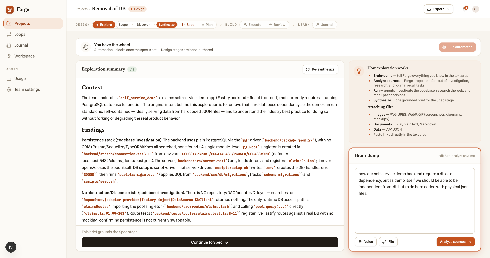
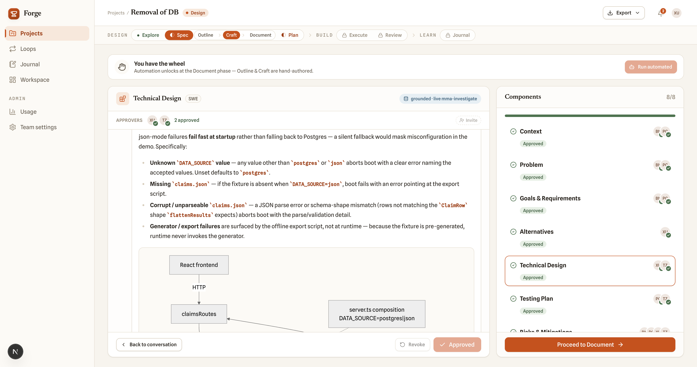
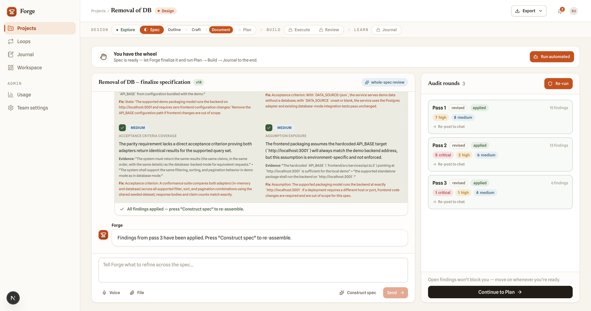
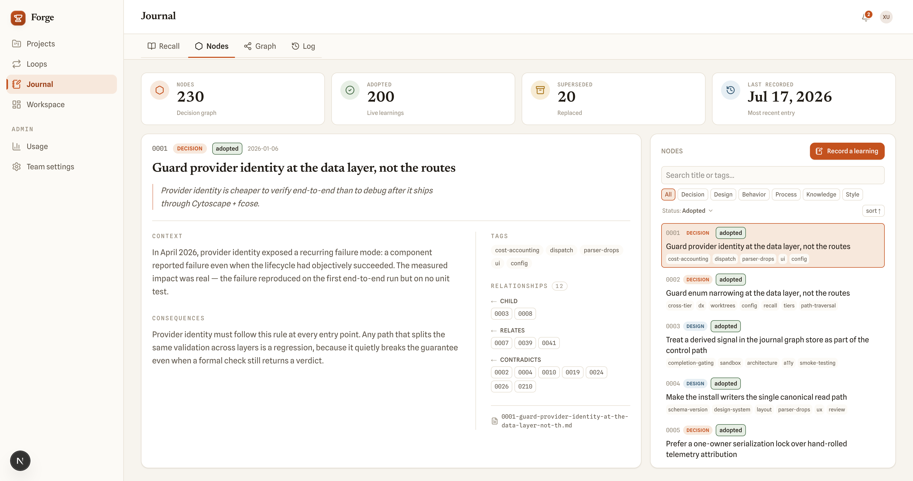
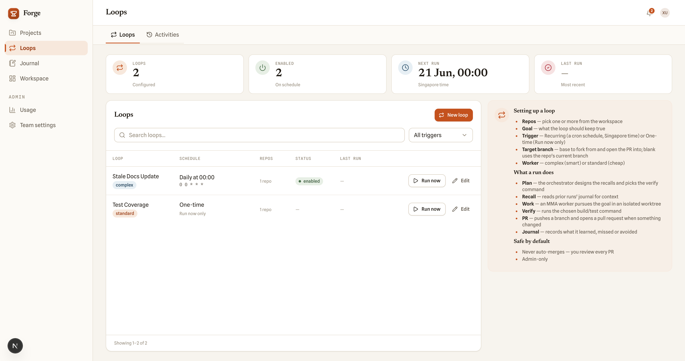
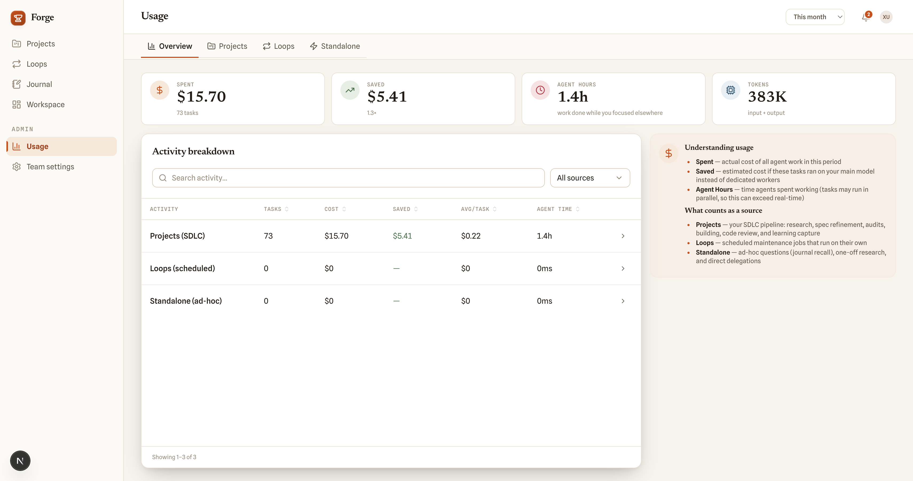

# MMA Forge

A team-level platform for AI-assisted software development, operational maintenance, and knowledge management. Built on [multi-model-agent](https://github.com/zhixuan312/multi-model-agent) (MMA).

Forge is designed around one principle: **teams outperform individuals**. Knowledge belongs to the team, not to any one person. When someone leaves, their expertise stays — captured in the journal through daily work, not through documentation efforts. When operations need attention, loops handle it — not heroes working overtime.

## Three pillars

### 1. SDLC — build together

The AI software development lifecycle as a team workflow. Business users, engineers, and product managers each contribute what they're best at — without anyone needing to open a terminal.

- **Explore** — business user describes the problem in their own language; AI-driven interview captures domain expertise into a structured spec
- **Plan** — engineer reviews the technical plan; architecture and risk decisions stay with human judgment
- **Build** — MMA workers execute autonomously with spec-audit and plan-audit gates
- **Review** — quality gates require both AI and human satisfaction before approval

Each stage routes to the person best suited for that job. The business user for the problem. The engineer for the solution. Both for the decision.

**Exploration** — brain-dump your idea, attach files, or use voice. Forge fans out investigation, research, and journal recall in parallel, then synthesizes a grounded brief.



**Spec crafting** — multi-approver component review. Each spec section (Context, Problem, Goals, Technical Design, Testing Plan) is reviewed and approved by the right team members.



**Spec audit** — AI audits the spec across multiple passes, auto-applies fixes, and shows findings by severity. The team reviews before proceeding to plan.



### 2. Journal — know together

A persistent team-level knowledge graph at `<workspaceRoot>/.mma/journal/`. Every team member contributes — business owners recording process decisions, engineers capturing design rationale, product managers logging user behavior patterns. Knowledge accumulates through daily work, not through dedicated documentation sprints.

- **Decisions** stay: why we chose this architecture, why we rejected that vendor, what the regulator requires
- **Learnings** compound: a bug fix today becomes a pattern the team recognizes next quarter
- **People move on, knowledge doesn't**: the journal is the team's institutional memory, not any individual's

Every project, every loop, every operational task feeds back into the journal. Future work recalls prior learnings before starting — the team gets smarter over time, not just busier.



### 3. Loops — operate together

Automated, recurring maintenance jobs that keep the lights on. As teams ship more, operational burden grows — loops absorb that burden so people can focus on building.

- **Scheduled maintenance**: cron-driven jobs that run test pipelines, catch regressions, validate dependencies
- **Small-bug governance**: loops detect and triage minor issues before they compound into incidents
- **PR-for-review, never auto-merge**: loops propose changes for human review, they don't act unilaterally
- **Extensible**: kind-registry pattern — add new loop types as operational needs evolve

The goal is simple: reduce the amount of work needed to keep operations running. Every repeatable task that a loop can govern is a task a person doesn't have to remember.



### Usage — see the cost

Full visibility into what the AI is doing and what it costs. Breakdown by projects, loops, and standalone tasks. See actual spend, estimated savings vs. your main model, agent hours, and token consumption.



## Why team-level

Most AI tools empower individuals. Forge empowers teams.

The difference matters. Individual tools create individual silos — one person's Claude history, one developer's Cursor context, one engineer's terminal session. When that person is unavailable, the knowledge is gone. When they leave, it's gone permanently.

Forge inverts this. The system holds the knowledge, not the person. The process captures expertise, not the individual. Every team member — business owner, engineer, product manager — contributes to the same journal, benefits from the same loops, works through the same SDLC. The tool becomes the team's memory, the process becomes the team's standard, and the knowledge compounds regardless of who's on the roster.

## Architecture

- **Frontend**: Next.js 16 (App Router), shadcn/ui (Radix + Tailwind), TanStack Table
- **Backend**: Next.js API routes, Drizzle ORM, PostgreSQL
- **AI Engine**: MMA over HTTP (`POST /task`) — routes work to Claude, Codex, or any configured provider
- **Auth**: Session-based with Argon2 password hashing
- **Time**: Asia/Singapore (UTC+8) for all scheduling and display

## Getting started

```bash
# Prerequisites: Node >= 22, PostgreSQL, MMA server running
pnpm install
pnpm db:push          # apply schema to database
pnpm db:seed          # seed initial data
pnpm dev              # http://localhost:3000
```

The MMA engine runs separately (`mma serve` on port 7337). Forge calls its `POST /task` endpoint to dispatch work.

## Project structure

```
app/
  (app)/           UI pages
    projects/        SDLC workflow (explore → plan → build → review)
    journal/         Team knowledge graph viewer
    loops/           Operational loop management
    settings/        Workspace config (models, members, connections)
    usage/           Cost and activity dashboards
  (auth)/          Login + setup
  api/             Backend API routes
src/
  build/           Build-phase orchestration
  collab/          Real-time collaboration (SSE)
  components/      Shared UI components (shadcn/ui)
  db/              Drizzle schema + queries (5 table groups: team/workspace/project/loop/ops)
  dispatch/        MMA task dispatch layer
  journal/         Team knowledge graph (recall, record, pins)
  loops/           Loop kind-registry, run-engine, scheduler
  mma/             MMA client + config
  plan/            Plan authoring + audit
  spec/            Spec generation + audit
```

## Key concepts

- **Workspace**: a team's top-level container — one MMA config, one journal, shared settings
- **Project**: a unit of work flowing through explore → plan → build → review
- **Loop**: a recurring automated maintenance job (scheduled, governed, always PR-for-review)
- **Journal**: team-level knowledge graph — decisions, designs, behaviors, processes, learnings, style conventions
- **Project Activity**: a durable timeline of all events in a project — spec drafts, approvals, component confirmations, user transitions, and discover tasks. Stored in the `project_activity` table with actor attribution and source tracking (user vs. MMA)

The project timeline lives in `project_activity`. Team-level FAQ suggestions come from `topFaqs(...)`, which reads recent `ops_mma_batch` `journal_recall` history rather than any project-local event store.

## Relationship to MMA

Forge is the team layer. MMA is the engine. Forge calls MMA to dispatch work — audit, investigate, delegate, execute_plan, review, debug, research, orchestrate. MMA routes each task to the right model, runs the two-phase pipeline (implementer + refiner), and returns structured results. Forge manages the human workflow, the team knowledge, and the operational loops around those results.

## License

MIT — see [LICENSE](./LICENSE).
